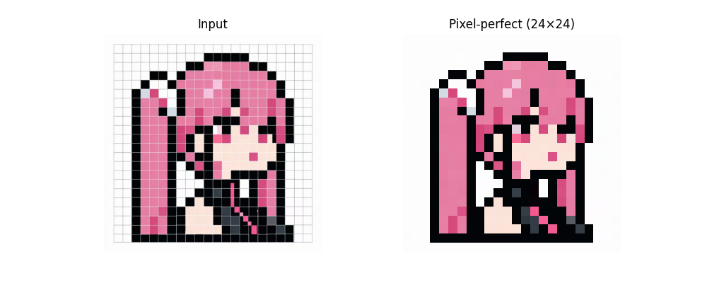
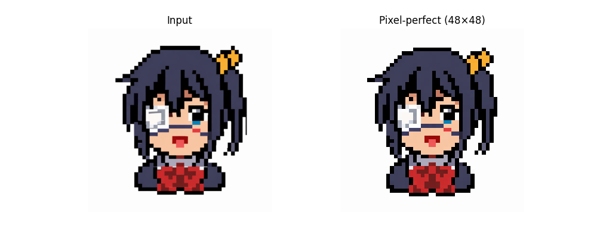
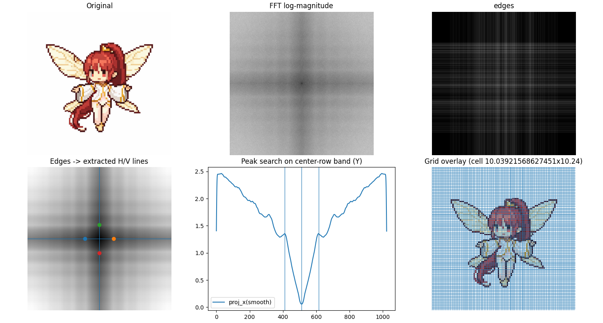
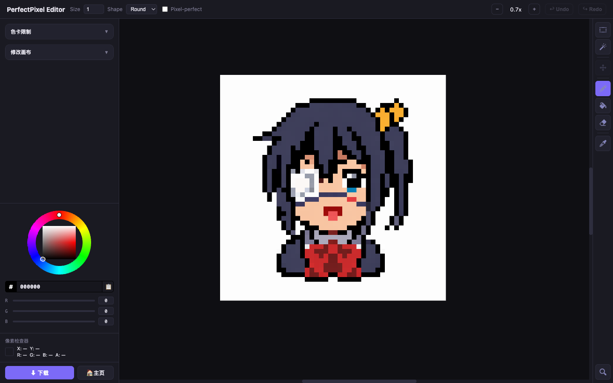

# PerfectPixel Tools

> **AI 像素画一站式处理：网格对齐 + 浏览器像素编辑器**


> **原始项目：** 本项目基于 [theamusing/perfectPixel](https://github.com/theamusing/perfectPixel) 开发，核心网格检测算法来自原作者。本仓库在此基础上扩展了本地 Web UI 和完整的浏览器像素编辑器。

---

## 这是什么

PerfectPixel Tools 让 AI 生成的像素画在一个工具里走完从粗糙到精准的全流程——**网格对齐、手动编辑修正、色卡规范化**，一气呵成，无需外部编辑器。



### 核心功能

| 功能 | 说明 |
|------|------|
| **自动网格对齐** | 基于 FFT 自动检测像素网格，Sobel 边缘精细化对齐，三种采样方式 |
| **色卡管理** | 4 种生成算法、3 种映射模式，支持 .gpl / .pal / .act 格式导入导出 |
| **像素编辑器** | 完整的浏览器内像素编辑器，7 种工具 + RotSprite 旋转 + 撤销/重做 |
| **一键流转** | 网格对齐完成后一键进入编辑器，无需导出再导入 |

---

## 快速开始

```bash
pip install flask opencv-python numpy pillow
python3 web_app.py
# 打开 http://localhost:5010
```

上传 AI 生成的像素画 → 自动网格对齐 → 「在编辑器中打开」 → 手动修正细节 → 应用色卡 → 下载成品。

---

## 网格对齐

标准缩放无法正确采样 AI 生成的像素画——网格大小不一致、非正方形。本工具自动检测最优网格，输出完美对齐的结果。



### 算法原理



1. **FFT 频谱分析** — 从原图的 FFT 幅度谱中检测网格尺寸
2. **Sobel 边缘精细化** — 用边缘检测微调网格线位置
3. **采样输出** — 用对齐后的网格采样原图，输出缩小后的精准像素画

### Python API

```python
import cv2
from perfect_pixel import get_perfect_pixel

bgr = cv2.imread("input.png", cv2.IMREAD_COLOR)
rgb = cv2.cvtColor(bgr, cv2.COLOR_BGR2RGB)

w, h, out = get_perfect_pixel(rgb)
```

<details>
<summary>API 参数参考</summary>

| 参数 | 说明 |
|------|------|
| **image** | RGB 图像 (H × W × 3) |
| **sample_method** | `"center"` / `"median"` / `"majority"` |
| **grid_size** | 手动指定网格尺寸 `(grid_w, grid_h)`，覆盖自动检测 |
| **min_size** | 有效像素的最小尺寸 |
| **peak_width** | 峰值检测的最小峰宽 |
| **refine_intensity** | 网格线精细化强度，推荐范围 [0, 0.5] |
| **fix_square** | 检测结果接近正方形时是否强制为正方形 |
| **debug** | 是否显示调试图 |

| 返回值 | 说明 |
|--------|------|
| **refined_w** | 精细化后的宽度 |
| **refined_h** | 精细化后的高度 |
| **scaled_image** | 精细化后的图像 (W × H × 3) |

</details>

### 双后端

| | OpenCV 后端 | 轻量后端 |
|---|---|---|
| **文件** | `perfect_pixel.py` | `perfect_pixel_noCV2.py` |
| **依赖** | `opencv-python` + `numpy` | 仅 `numpy` |
| **安装** | `pip install perfect-pixel[opencv]` | `pip install perfect-pixel` |

---

## 像素编辑器（Ver 1.2）

完整的浏览器内像素编辑器，单文件 `editor.html`（~5000 行），无需构建工具。



### 工具集

| 工具 | 快捷键 | 说明 |
|------|--------|------|
| 铅笔 | B | 逐像素绘制，支持笔刷大小/形状，Pixel-perfect 模式 |
| 橡皮擦 | E | 擦除像素为透明 |
| 油漆桶 | G | BFS 填充，支持容差和连续/全局模式 |
| 矩形选框 | M | 框选矩形区域，网格吸附，蚂蚁线动画 |
| 魔棒 | W | 按颜色相似度自动选取区域 |
| 移动 | V | 拖移/缩放/旋转选区内容 |
| 吸管 | I | 从画布或屏幕任意位置取色 |

### 编辑器特性

- **撤销/重做** — 快照式历史，覆盖所有操作（含画布尺寸变更）
- **RotSprite 旋转** — 像素画专用旋转算法（Scale2×3 + 最近邻 + 下采样），无抗锯齿
- **8 控制点缩放** — 角手柄双模式：内圈缩放，外圈旋转
- **Canvas Size** — S 键打开，6 参数实时参考线预览
- **色卡系统** — 生成/加载/应用色卡，破坏性写入（可 undo）
- **精确下载** — 整数倍缩放导出，`imageSmoothingEnabled=false` 保证像素清晰

### 技术架构

```
三层 Canvas 堆叠（position: absolute）
├── cursor-canvas   (z:3)  ← 笔刷预览，接收所有 pointer 事件
├── selection-canvas (z:2)  ← 蚂蚁线 + 变换手柄
└── pixel-canvas    (z:1)  ← 实际像素数据（EditorState.pixels）

EditorState = 唯一数据源（Uint8ClampedArray）
├── 所有像素读写通过 EditorState.pixels
├── Canvas 元素仅用于显示，从不读取
└── History = [{pixels, width, height}, ...]
```

---

## ComfyUI 集成

ComfyUI 自定义节点，可在 ComfyUI 工作流中使用 PerfectPixel 网格对齐。

→ [ComfyUI 节点使用说明](integrations/comfyui/README.md)

---

## 项目结构

```
perfectPixel_ver1.1/
├── src/perfect_pixel/          ← 核心算法库（已发布到 PyPI）
│   ├── perfect_pixel.py        ← OpenCV 后端
│   └── perfect_pixel_noCV2.py  ← NumPy-only 后端
├── web_app.py                  ← Flask 服务器（port 5010）
├── web_ui.html                 ← 网格对齐 Web UI
├── editor.html                 ← 像素编辑器（Ver 1.2）
└── integrations/comfyui/       ← ComfyUI 节点
```

---

## License

MIT
