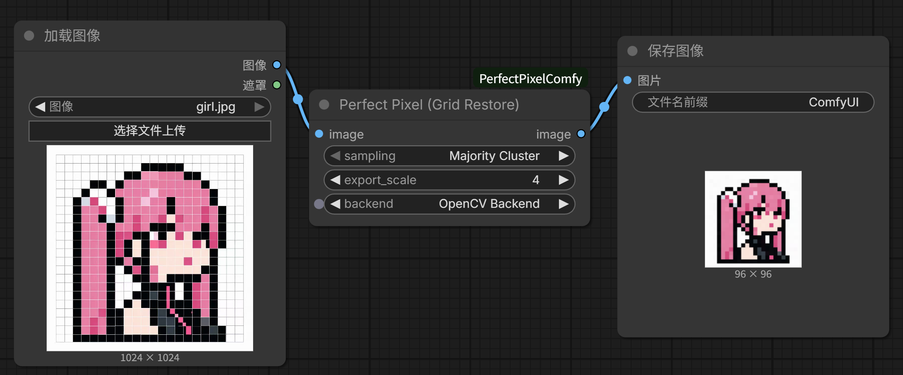

# PerfectPixel ComfyUI Node

This document describes the usage of the **Perfect Pixel (Grid Restore)** node in ComfyUI.

> For Chinese documentation, see: 
> https://github.com/TobyKSKGD/perfectPixel-ComfyUI#

## Node Parameters



The **Perfect Pixel (Grid Restore)** node provides the following configurable parameters:

- **sampling**
  Sampling method used when restoring pixel grids.

- **export_scale**
  Scaling factor applied to the output image.

- **backend**
  Backend implementation to use:
  - **Auto**: Automatically selects the available backend
  - **OpenCV Backend**: Uses OpenCV for better performance
  - **Lightweight Backend**: NumPy-only implementation without OpenCV

## Getting Started

### One-Click Installation

If Git is already installed, run the following command inside `ComfyUI/custom_nodes` and then restart ComfyUI:

```bash
git clone https://github.com/TobyKSKGD/perfectPixel-ComfyUI.git

# Recommended: Fast version with OpenCV support
pip install perfect-pixel[opencv]

# Or Numpy version: Lightweight (NumPy only)
# pip install perfect-pixel
```

If you are not sure how to install Python packages in ComfyUI’s Python environment on Windows, 
please refer to **[Installing Python Dependencies in the ComfyUI Environment (Windows)](#Installing Python Dependencies in the ComfyUI Environment (Windows))** below.

### Manual Installation

Download this repository, then copy the entire `./integrations/comfyui/perfectPixel-ComfyUI` folder into `ComfyUI/custom_nodes`.

In addition, copy the following two core files from the original Perfect Pixel source into the same `PerfectPixelComfy` folder:

- `./src/perfect_pixel/perfect_pixel.py`
- `./src/perfect_pixel/perfect_pixel_noCV2.py`

These files are required by the node at runtime.

Restart ComfyUI after copying.

After restarting, search for **Perfect Pixel (Grid Restore)** in the node search panel on the left to find the node.
The node is located at: `Image → Post Processing → Perfect Pixel (Grid Restore)`

## Dependencies

This node requires the following dependencies:

- `numpy`
- `opencv-python` (optional, required for OpenCV backend)

Install dependencies with:

```bash
pip install numpy
pip install opencv-python
```

## Installing Python Dependencies in the ComfyUI Environment (Windows)

ComfyUI uses its **own embedded Python environment**, which may be different from your system Python or Conda environment.
 Installing packages with `pip` in your system terminal may **not** make them available to ComfyUI.

To install Python dependencies correctly, you must use **the Python executable that ComfyUI is running with**.

### Step 1: Find the Python executable used by ComfyUI

On Windows, start ComfyUI by running one of the provided `.bat` files (for example `run_cpu.bat`, `run_nvidia_gpu.bat`, etc.).

When ComfyUI starts, look at the startup log in the terminal. You should see lines similar to:

```bash
** Python version: 3.12.10
** Python executable: G:\ComfyUI\ComfyUI_windows_portable\python_embeded\python.exe
```

The path shown after **Python executable** is the Python environment used by ComfyUI.

### Step 2: Install dependencies using ComfyUI’s Python

Run the following commands in a terminal **using the Python executable shown in your ComfyUI startup log**:

```bash
[path_to_your_ComfyUI_python]\python.exe -m pip install -U pip

# Recommended: Fast version with OpenCV support
[path_to_your_ComfyUI_python]\python.exe -m pip install "perfect-pixel[opencv]"

# Or Numpy version: Lightweight (NumPy only)
# [path_to_your_ComfyUI_python]\python.exe -m pip install perfect-pixel

# Dependencies
[path_to_your_ComfyUI_python]\python.exe -m pip install numpy
[path_to_your_ComfyUI_python]\python.exe -m pip install opencv-python
```

**Example (Windows portable build):**

```bash
G:\ComfyUI\ComfyUI_windows_portable\python_embeded\python.exe -m pip install -U pip
G:\ComfyUI\ComfyUI_windows_portable\python_embeded\python.exe -m pip install "perfect-pixel[opencv]"
```

> ⚠️ **Important:**
>  Replace `[path_to_your_ComfyUI_python]` with the **actual Python executable path** shown in your ComfyUI startup log:
>
> ```bash
> ** Python executable: ...\python.exe
> ```

**Tip:** Do not use `pip install` from your system Python or Conda environment.
 Always install packages using the Python executable that ComfyUI is running with.
